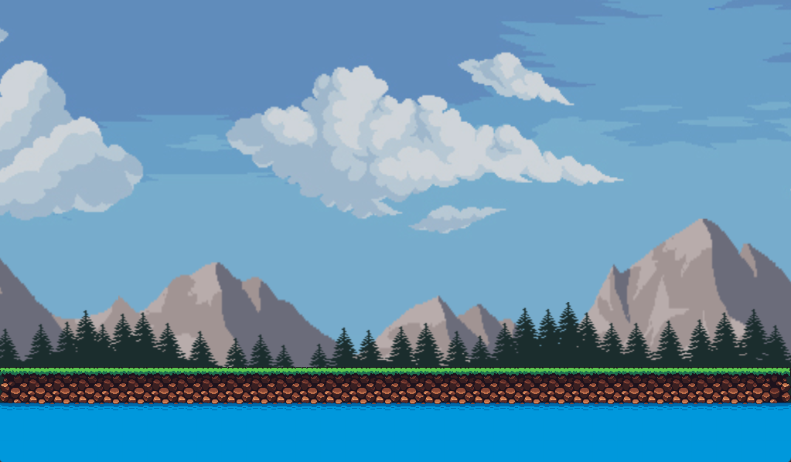
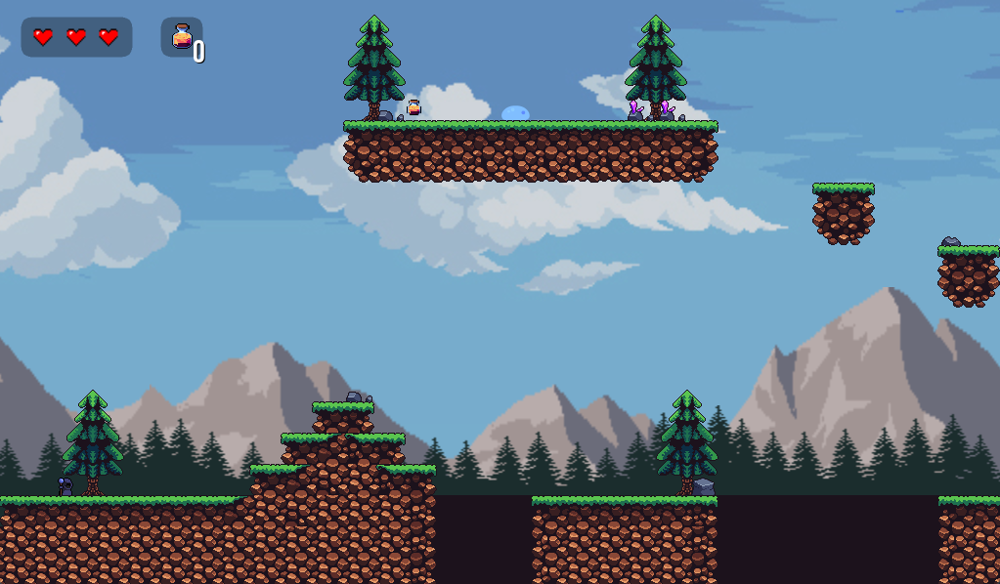
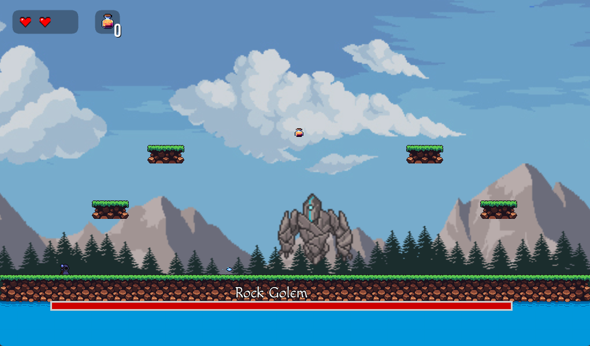

# The Quest for Knowledge

This is a 2d platformer game, where the player is a questing mage, hoping to make it through the world so that he can increase his knowledge. 

This game was created in 4ish weeks by a single person, [Jaron Ritter](https://github.com/jaronritter01)

The purpose of this game was to learn the Godot engine and to get familiar with certain design pattern and overall video game design.
If you have comments on how to make the game better or general tips for video game design feel free to shoot me an [email](mailto:jaronritter01@gmail.com) or leave in a comment.

## Overview
___________

It's a 2d platformer, most people are familiar with how it works but your goal is to get to the end of the level progressing to the right and maybe doing a little exploring along the way

There will be items to collect and monsters to battle along your journey so be careful. Not all enemies have to be fought but you will required to defeat some to be able to progress

## Controls 
___________

- w to jump (you have a double jump as well just press twice)
- a to move left
- d to move right
- space to hover
- lmb for a light and fast projectile
- rmb for a heavy and slower spell 
- f to toggle current item
- r to use current item
- **Tip** dont be afraid to play around with your spells
- **NOTE** The staff item has no function currently

## Getting Started
__________________

Head over to [itch.io]() to play the game, thats all!

## Future Plans
_______________

This game is still in its infancy, so with that in mind below are some of the changes I would like to make, provided I have time

- I would like to really flush the levels and make them bigger and have more things in them
- Add more items to the game and give them use 
- Refactor some of the players code
- Add a main menu (once more levels are created), like a world selector 
- Add a story and possibly npc's for the player to interact with
- Change the inventory system to a grid based system instead of a toggle based
- I would also like to make it so that the player can choose a specific mage to play the game with, all of them having different abilities
- Add a saving system so that you're not restarting every time you play

## Screenshots
--------------

## Assets
---------

- Rock Boss - https://darkpixel-kronovi.itch.io/mecha-golem-free​
- Mage - https://rgsdev.itch.io/pixel-art-animated-mages-character-pack-rgsdev
- Slime - https://www.kenney.nl/assets
- Knight - https://rgsdev.itch.io/pixel-art-animated-knight-character-pack-rgsdev/devlog/18...
- Tiles - https://oddpotatogift.itch.io/32x32-platformer